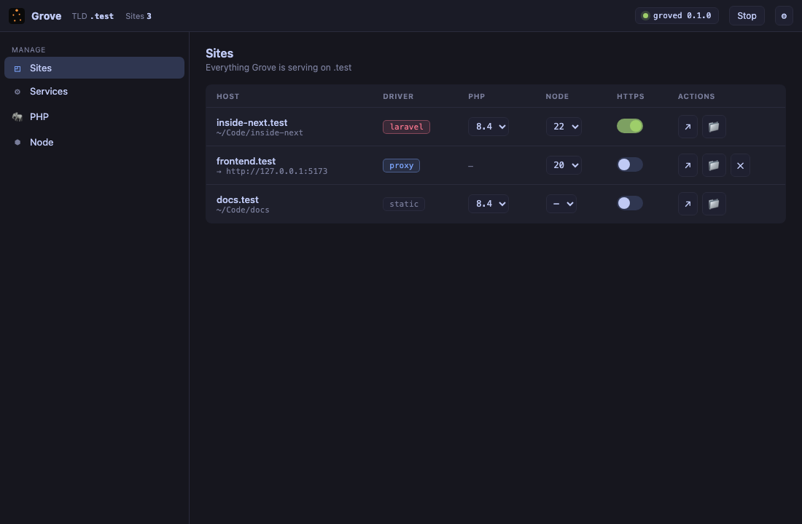
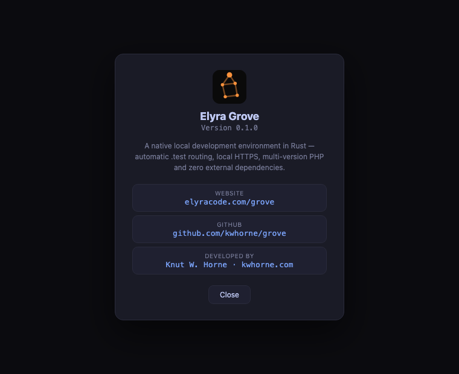

<div align="center">


# Elyra Grove

**A native local development environment in Rust.**

Grove serves `*.test` domains with automatic routing, local HTTPS, multi-version
PHP and zero external dependencies — from a single Rust core.

[](https://github.com/kwhorne/grove/actions/workflows/ci.yml)
[](https://github.com/kwhorne/grove/releases)
[](LICENSE)
[](https://www.rust-lang.org)
[](#status)
[](#gui-tauri--svelte)

</div>

<p align="center">
  
</p>

---

## Why Grove

Local PHP/Laravel development today means choosing between friction points:

- **Laravel Valet** is elegant and light, but macOS-only and leans on Homebrew + Composer + dnsmasq.
- **Herd** ships static binaries but is closed, won't let you load custom PHP extensions, and gates databases, mail testing and dumps behind a Pro license.
- **Docker / Sail** is flexible but heavy and slow for simple local work.

Grove takes a different path: **one Rust codebase, three platforms, and nothing to install around it.**

| | Valet | Herd | Docker/Sail | **Grove** |
| --- | :---: | :---: | :---: | :---: |
| Cross-platform | macOS only | macOS + Win | ✅ | ✅ |
| No Homebrew/Composer/dnsmasq | ❌ | ✅ | ➖ | ✅ |
| Custom / bring-your-own PHP | ✅ | ❌ | ✅ | ✅ |
| Bundled static PHP | ❌ | ✅ | ➖ | ✅ |
| Idle footprint | tiny | small | heavy | tiny |
| Open / no license wall | ✅ | ❌ | ✅ | ✅ |

## Features

- 🌐 **Automatic `*.test` routing** via an embedded DNS resolver — no manual hosts editing.
- 🔒 **Local HTTPS** with a private root CA and on-demand per-site leaf certificates.
- 🐘 **Bundled PHP** — install multiple self-contained versions (`grove php install 8.5|8.4|8.3`), with per-site `isolate` and lazy FPM pools.
- ⬢ **Bundled Node.js** — download node · npm · npx, with per-site Node versions; no nvm or Homebrew.
- 🗄️ **Bundled services** — Grove downloads and supervises PostgreSQL, MySQL and Redis itself, so there is no database/cache or Homebrew to install separately.
- 📧 **Built-in mail-catcher** — an SMTP server that captures outgoing mail, with a Mailpit-style viewer.
- 🌍 **Public tunnels** — `grove share` exposes a local site to the internet (demos, webhooks) via a self-hostable, native Expose/ngrok alternative.
- 🧩 **Driver system** — Laravel, WordPress, generic PHP, static sites, and reverse proxy (Vite/Node).
- 🌱 **Create / import sites** — scaffold a new Laravel or static project, or link existing ones.
- 🖥️ **GUI + CLI in parity** — both are thin clients over the same daemon, plus a macOS menu-bar icon.
- 🔌 **Zero external dependencies** — DNS, proxy, FastCGI and TLS are all built in.

## Zero external dependencies

Grove has no runtime dependency on Homebrew, Composer, dnsmasq, OpenSSL or
Laravel Valet. DNS, the reverse proxy, FastCGI and TLS are all built into the
Rust core. Even PHP can be downloaded as a self-contained static binary via
`grove php install` — it links only against the operating system's own
libraries. `grove import` *reads* an existing Valet config if one is present,
but it never requires Valet to be installed.

## Quick start

> 📘 **New here? Read the [full installation guide](docs/INSTALL.md)** — a
> step-by-step manual with example terminal output, a first site, HTTPS,
> services and troubleshooting.

```bash
# 1. First-run setup: config, root CA, a static PHP build, resolver + trust
sudo grove init

# 2. Install the background service (root daemon, binds 80/443/53, starts at boot)
sudo grove install

# 3. Point Grove at your projects
grove park ~/Code           # every subdirectory becomes <name>.test
#   or, inside one project:
grove link

# 4. Open https://myproject.test 🎉
grove secure myproject      # enable HTTPS
grove isolate myproject 8.3 # pin a PHP version for this site
```

> The daemon binds privileged ports (53/80/443) and runs PHP as your user, so
> it is installed as a root service. `sudo grove start` works too for a
> foreground/one-off run.

From a clean machine to a running `*.test` Laravel app in under five minutes —
no Homebrew, no Composer, no Valet.

## Command reference

| Category | Commands |
| --- | --- |
| Setup | `init`, `ca trust` / `ca uninstall`, `install` / `uninstall` (service) |
| Lifecycle | `daemon`, `start`, `stop`, `restart` |
| Sites | `new`, `park` / `unpark`, `link` / `unlink`, `list`, `secure` / `unsecure`, `isolate` / `unisolate`, `proxy` |
| PHP | `php install`, `php register`, `php discover`, `php list`, `use` |
| Node | `node list`, `node install <version>`, `node use <site> <version>`, `node unuse <site>` |
| Services | `service list`, `service install`, `service start`, `service stop`, `service restart` |
| Tunnels | `share <site>` (public URL via `grove-tunnel` server) |
| Mail | `mail`, `mail show <id>`, `mail clear` |
| Logs | `logs` (list sources), `logs <site>` (view entries) |
| Operations | `status`, `doctor`, `env [site]`, `import` (Valet) |

Every command supports `--json` for scripting and [Elyra Conductor](https://github.com/kwhorne/elyra-conductor) integration.

## GUI (Tauri + Svelte)

<p align="center">
  
</p>

The GUI is a thin client that proxies everything to the daemon over the same
`grove-ipc` JSON-RPC the CLI uses — they are always in parity. The frontend is
Svelte 5 + Vite and shares the Elyra Conductor look & feel (Tokyo Night palette,
JetBrains Mono). The dashboard surfaces every site with its driver, PHP version,
a one-click HTTPS toggle, isolate, and shortcuts to open in the browser or
Finder, alongside service, mail, logs and `doctor` panels. The Logs panel parses
per-site Laravel logs and Grove's own service logs into a level/date/message view
with a stacktrace detail pane. A Settings panel (⌘,)
manages parked paths, the TLD, default PHP, the mail-catcher port,
launch-at-login and the theme (auto/light/dark).

```bash
# Build the frontend (the GUI binary embeds it at compile time)
cd crates/grove-gui/ui && pnpm install && pnpm build && cd -

# Build and launch
cargo build --release -p grove-cli -p grove-gui
grove gui              # starts the daemon if needed, then opens the app
```

After changing the UI, rebuild the frontend **and** `grove-gui` so the new bundle
is re-embedded. Closing the window keeps Grove running in the menu bar; quit via
the menu-bar icon.

## Configuration

Grove's source of truth is a single declarative TOML file
(`$GROVE_HOME/config.toml`). Runtime state that can be re-derived is kept out of
it, so the file stays human-readable and diff-friendly.

```toml
[general]
tld = "test"
default_php = "8.4"
auto_start = true

[[parked]]
path = "~/Code"

[services]
mail_enabled = true
mail_port = 1025

[[sites]]
name = "inside-next"
path = "~/Code/inside-next"
php = "8.4"          # per-site PHP
node = "22"          # per-site Node
secure = true
driver = "laravel"

[[sites]]
name = "frontend"
path = "~/Code/frontend"
driver = "proxy"
proxy_to = "http://127.0.0.1:5173"
```

## Architecture

A single long-running daemon binds the privileged ports (DNS 53, HTTP 80,
HTTPS 443) and supervises the FPM pools. The CLI and GUI are thin clients that
talk to the daemon over local IPC.

```
grove-core      site registry, driver detection, config, paths   (pure, no OS I/O)
grove-ipc       JSON-RPC protocol + transport (CLI/GUI ↔ daemon)
grove-tls       root CA + leaf issuance (rcgen/rustls)
grove-dns       embedded resolver for *.<tld> (hickory)
grove-proxy     HTTP/HTTPS proxy + minimal FastCGI client (hyper)
grove-runtime   PHP version + FPM pool supervisor
grove-os        platform integration (resolver, trust store, elevation)
grove-daemon    long-running process: binds ports, serves IPC
grove-cli       clap frontend (binary: `grove`)
grove-gui       Tauri 2 + Svelte 5 desktop GUI (thin client over grove-ipc)
```

## Building from source

```bash
# Requirements: Rust 1.80+, and (for the GUI) Node 20+ with pnpm.
cargo build --release        # build the CLI + daemon
cargo test                   # run the test suite
```

For local testing without binding privileged ports, set an isolated home and
high ports:

```bash
export GROVE_HOME=/tmp/grove-home
mkdir -p "$GROVE_HOME"
cat > "$GROVE_HOME/config.toml" <<'EOF'
[general]
tld = "test"
default_php = "8.4"
http_port = 8080
https_port = 8443
dns_port = 5354

[[parked]]
path = "~/Code"
EOF
grove daemon
```

## Installing the macOS app

From **0.1.2** the macOS app is **code-signed with a Developer ID and notarized
by Apple**, so it opens normally — download the `.dmg`, drag Grove to
`/Applications`, and launch it. No Gatekeeper warning, no workarounds.

To actually serve `*.test` (which needs ports 53/80/443), install the background
service once: `sudo grove install`. The GUI is a dashboard over that daemon.

## Documentation

- [Installation guide](docs/INSTALL.md) · [Tunnels](docs/TUNNEL.md) · [Architecture](docs/ARCHITECTURE.md) · [Configuration](docs/CONFIGURATION.md) · [Commands](docs/COMMANDS.md) · [Testing](docs/TESTING.md)
- [Changelog](CHANGELOG.md)

## Contributing

Contributions are welcome! See [CONTRIBUTING.md](CONTRIBUTING.md) to get started,
and please follow our [Code of Conduct](CODE_OF_CONDUCT.md). For security issues,
see [SECURITY.md](SECURITY.md).

## License

[MIT](LICENSE)

<div align="center">
<sub>Built by <a href="https://kwhorne.com">Knut W. Horne</a> · part of the Elyra ecosystem</sub>
</div>
